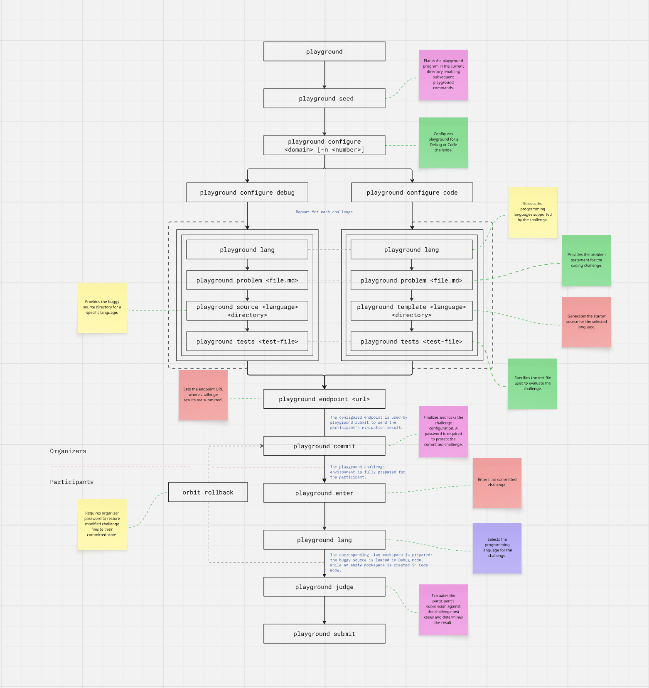

# Playground

Playground is a CLI tool that makes coding competitions easy to set up, run, and evaluate.

The organizer prepares the competition once. Participants receive a ready-made environment and focus only on the challenge. Playground handles compiling, running, testing, and marking.



## Quick start

**Organizer**

```sh
playground seed                 # plant Playground in an empty directory
playground configure debug      # set up a challenge
playground endpoint <url>       # set the submission endpoint
playground commit               # seal the environment for distribution
```

**Participant**

```sh
playground enter                # enter the prepared environment
playground lang                 # choose a language
playground judge                # test your solution locally
playground submit               # send your solution for evaluation
```

## Commands

### Organizer

| Command | Description |
| --- | --- |
| `playground seed` | Plant the Playground environment in the current (empty) directory. |
| `playground configure <type>` | Configure a challenge, e.g. `debug` or `code`. |
| `playground endpoint <url>` | Set the submission endpoint. |
| `playground commit` | Finalize the setup so it can be distributed. |

### Participant

| Command | Description |
| --- | --- |
| `playground enter` | Enter the prepared environment. |
| `playground lang` | Select the language to work in. |
| `playground judge` | Run your solution and see the result. |
| `playground submit` | Submit your solution. |

> Participants never run `playground seed`.

## Organizing a competition

Start in an empty directory.

```sh
playground seed
```

Configure each challenge you need:

```sh
playground configure debug
playground configure code
```

While configuring, you can prepare:

- Problem statement
- Buggy source code or starter template
- Test cases
- Supported languages
- Marks and evaluation rules

Set where submissions go, then commit:

```sh
playground endpoint <url>
playground commit
```

The committed environment is what you distribute to participants.

## Taking part

Enter the environment you were given:

```sh
playground enter
```

Pick a language, work on the challenge source, and check your progress:

```sh
playground lang
playground judge
```

When you are happy with the result:

```sh
playground submit
```

## How evaluation works

```
compile → run → provide input → capture output → check output → calculate marks
```

The evaluator does not need to know how your program is implemented. It only needs to know how to run it, what input to give, and how the output should be checked.

## What participants can and cannot see

| Visible and editable | Hidden |
| --- | --- |
| Challenge source (e.g. the buggy program) | Playground's source code |
| | Evaluator implementation |
| | Hidden test cases |
| | Internal evaluation logic |
| | Organizer-only configuration |

Challenge source is the code you are meant to work on. Playground source is the evaluation machinery, kept separate so you interact with the challenge, not the evaluator.
